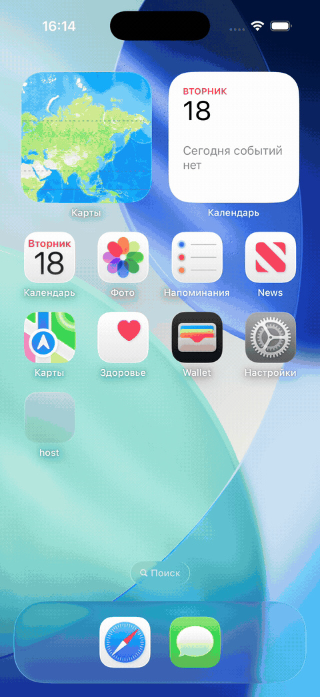

# CRM Client & Employee Profile

React Native-приложение с карточкой клиента и профилем сотрудника. Проект выполнен как monorepo: host-приложение подгружает экраны из отдельного микрофронта через Module Federation.

## Демонстрация



Исходное видео в полном качестве: [demo.mov](./demo.mov).

## Что реализовано

- Экран **«Клиент»**: шапка с названием компании, статусом и ИНН; основная информация; список контактов и кнопка создания активности.
- Экран **«Профиль сотрудника»**: информация о сотруднике, рабочие контакты, подразделение, часовой пояс и текущее время, которое обновляется раз в минуту.
- Переход из карточки клиента в профиль менеджера.
- Интерактивные телефонные номера и email через `Linking`.
- Действие «Создать активность» с уведомлением `Alert`.
- Отдельный API-слой, моковые данные, query keys и состояния загрузки/ошибки на базе React Query.
- Общий `ui-kit` с переиспользуемыми элементами интерфейса.
- Подключение экранов как удаленных модулей в host-приложении с `React.lazy` и `Suspense`.

## Структура проекта

```text
packages/
  host/         # Контейнер приложения и корневая навигация
  MicroFront/   # Микрофронт: экраны, API, хуки и моки
  ui-kit/       # Общие UI-компоненты и тема
  sdk/          # Вспомогательная конфигурация для micro frontend
```

## Запуск

Требуются Node.js 22+, pnpm 9.15.3, Xcode и CocoaPods для запуска на iOS.

```bash
pnpm install
```

Установите CocoaPods-зависимости для обоих React Native-пакетов:

```bash
cd packages/host && bundle install && cd ios && bundle exec pod install
cd ../../MicroFront && bundle install && cd ios && bundle exec pod install
```

Запустите dev-серверы и соберите host-приложение для iOS:

```bash
pnpm start
pnpm run:host:ios
```

Подробные требования к окружению, известные нюансы CocoaPods и альтернативные команды приведены в [SETUP.md](./SETUP.md).

## Исходное задание

Оригинальные требования сохранены в [TECHNICAL_SPECIFICATION.md](./TECHNICAL_SPECIFICATION.md).
